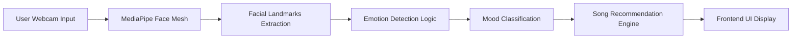
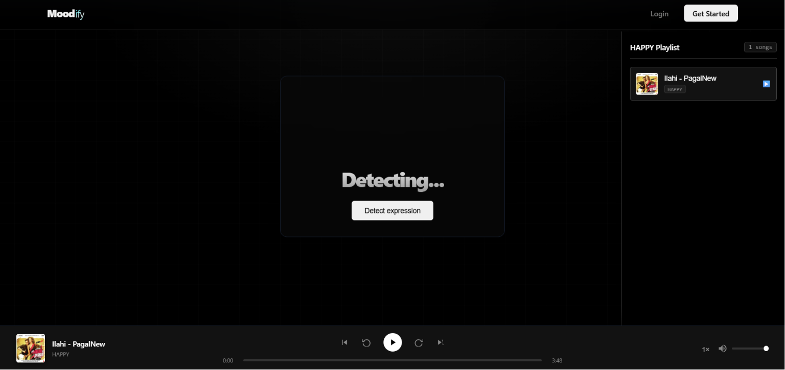

## 🎭 Moodify

**An AI-powered mood detection and music recommendation web app that detects user emotions using MediaPipe and suggests songs based on real-time facial expressions.

---

## 🚀 Live Demo

- **Website:** https://moodify-zoyd.onrender.com
- **Repository:** https://github.com/Lokesh-coder-tech/Backend-Development-Journey

---

# 📖 Overview

Moodify is an intelligent emotion-based music recommendation system. It uses MediaPipe face detection and landmark tracking to analyze facial expressions in real time and predict the user's mood. Based on the detected emotion, it recommends suitable songs to enhance or balance the user’s mood.

The goal of this project is to combine computer vision + AI + music recommendation into a simple and interactive user experience.

---

# ✨ Features

-😊 Real-time mood detection using webcam
-🎯 Accurate facial landmark tracking with MediaPipe
-🎵 Mood-based song recommendations
-⚡ Instant response system
-🧠 Emotion classification (Happy, Sad, Neutral, Surprised.)
-📱 Simple and responsive UI
-🎥 Live camera integration
-🔊 Dynamic playlist generation
-💡 Lightweight and fast processing

---

# 🛠 Tech Stack

| Layer | Technology |
|--------|------------|
| Frontend | React + Vite + SCSS |
| Backend | Node.js + Express |
| Database | MongoDB |
| AI/ML | MediaPipe (Face Detection) |
| Deployment | Render |

> Note: MediaPipe provides real-time face tracking and landmark detection which helps in emotion estimation.

---

# 🏗 Folder Structure

```text
Moodify/
│
├── Backend/
|   ├── node_modules/
|   ├── public/
|   ├── src/
│   |   ├── config/
│   |   ├── controllers/
│   |   ├── middlewares/
│   |   ├── models/
│   |   ├── routes/
│   |   ├── services/
│   |   └── app.js
|   ├── .env
|   ├── server.js
|   ├── package.json
|   └── package-lock.json
│
├── frontend/
|   ├── node_modules/
│   ├── public/
│   ├── src/
│   │   ├── features/
│   │   ├── App.jsx
│   │   ├── AppRoutes.jsx
│   │   ├── main.jsx
│   │
│   ├── index.html
│   ├── package.json
|   ├── package-lock.json
|   ├── eslint.config.js
|   └── .gitignore
|
├── assets
└── README.md
```

---

# 🔄 Workflow



---

# 📡 API Endpoints

## 🔐 Auth API Endpoints

- `POST /api/auth/register` → Register user  
- `POST /api/auth/login` → Login user  
- `GET /api/auth/get-me` → Get logged-in user  
- `GET /api/auth/logout` → Logout user  

---


## 🎵 Songs API Endpoints

- `POST /api/songs/` → Upload songs 
- `GET /api/songs/` → Get songs 

---

# ⚙️ Installation

```bash
git clone https://github.com/Lokesh-coder-tech/Backend-Development-Journey.git

cd Backend-Development-Journey/Moodify
```

Backend

```bash
cd Backend
npm install
npm run dev
```

Frontend

```bash
cd Frontend
npm install
npm run dev
```

---

# 🔑 Environment Variables

```env
MongoDB Connection
MONGO_URI=your_mongodb_connection_string_here

JWT Secret
JWT_SECRET=your_jwt_secret_here

Redis Configuration
REDIS_HOST=your_redis_host
REDIS_PORT=your_redis_port
REDIS_PASSWORD=your_redis_password

ImageKit Configuration
IMAGEKIT_PRIVATE_KEY=your_imagekit_private_key
IMAGEKIT_PUBLIC_KEY=your_imagekit_public_key
IMAGEKIT_URL_ENDPOINT=your_imagekit_url_endpoint
```

> Replace the placeholder values with your own credentials before running the project.

---

# 📸 Screenshots

## Home Page



---

# 🚀 Future Improvements

-🎤 Voice emotion detection
-🤖 AI-based playlist generation
-🎧 Spotify integration
-📊 Mood history tracking
-🌙 Dark mode UI
-📱 Mobile optimization

---

# 🤝 Contributing

Contributions are welcome.

1. Fork
2. Create a branch
3. Commit
4. Push
5. Open a Pull Request

---

# 👨‍💻 Author

**Lokesh Sharma**

- GitHub: https://github.com/Lokesh-coder-tech
- LinkedIn: https://linkedin.com/in/lokeshsharma-dev

---

# ⭐ Support

If you like this project, please **star the repository**.

---

# 📄 License

MIT License.

<p align="center">
Built with ❤️ by <b>Lokesh Sharma</b>
</p>