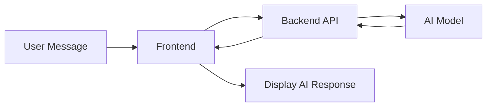
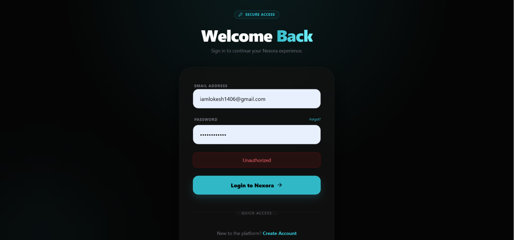
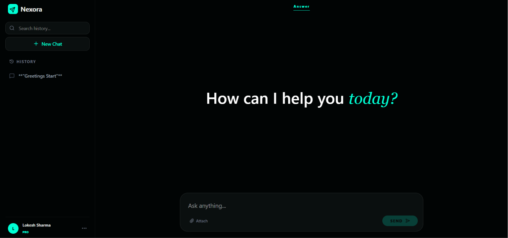
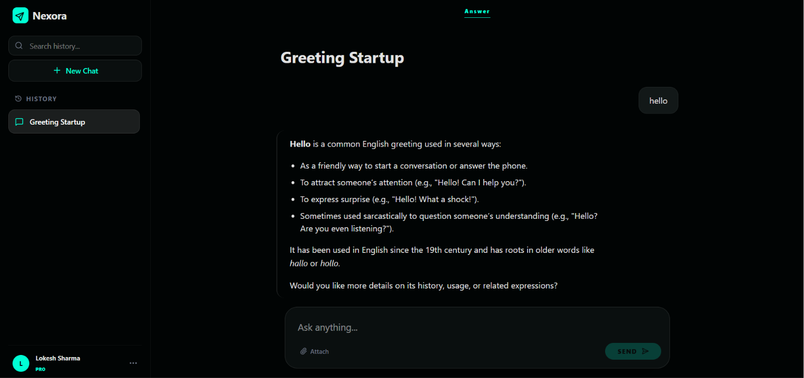
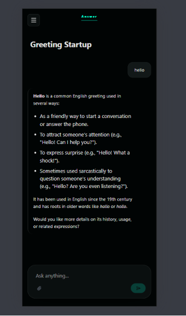

# 🤖 Neoxra

**A modern AI-powered chat application that enables users to interact with intelligent AI assistants through a fast, responsive, and intuitive interface.**

---

## 🚀 Live Demo

- **Website:** https://nexora-pgoi.onrender.com
- **Repository:** https://github.com/Lokesh-coder-tech/Backend-Development-Journey

---

# 📖 Overview

Neoxra is a full-stack AI chat application designed to provide seamless conversations with AI models. It features a clean user interface, real-time responses, conversation history, and a scalable backend architecture for integrating multiple LLM providers.

---

# ✨ Features

- 💬 AI-powered conversations
- ⚡ Real-time chat responses
- 📝 Chat history
- 🧠 Context-aware conversations
- 🎨 Clean and modern UI
- 📱 Fully responsive design
- 🔒 Secure backend architecture
- ☁️ Render deployment
- 🚀 Fast API communication
- 🧩 Modular codebase

---

# 🛠 Tech Stack

| Layer | Technology |
|--------|------------|
| Frontend | React + Vite + CSS |
| Backend | Node.js + Express |
| Database | MongoDB |
| AI | LangChain + Mistral API |
| Deployment | Render |

> Note: Additional AI providers can be integrated easily through the modular backend architecture.

---

# 🏗 Folder Structure

```text
Nexora/
│
├── Backend/
│   ├── node_modules/
│   ├── public/
│   ├── src/
│   │   ├── config/
│   │   ├── controllers/
│   │   ├── middlewares/
│   │   ├── models/
│   │   ├── routes/
│   │   ├── services/
│   │   ├── sockets/
│   │   ├── validators/
│   │   └── app.js
│   │
│   ├── .env
│   ├── package.json
│   ├── package-lock.json
│   └── server.js
│
├── Frontend/
│   ├── node_modules/
│   ├── public/
│   ├── src/
│   ├── .gitignore
│   ├── eslint.config.js
│   ├── index.html
│   ├── package.json
│   ├── package-lock.json
│   └── vite.config.js
│
└── README.md
```

---

# 🔄 Workflow



---

# 📡 API Endpoints

## 🔐 Authentication

| Method | Endpoint | Description |
| :----: | -------- | ----------- |
| POST | `/api/auth/register` | Register a new user |
| POST | `/api/auth/login` | Authenticate an existing user |
| GET | `/api/auth/getMe` | Get authenticated user details |
| GET | `/api/auth/verify-email` | Verify user's email address |

---

## 💬 Chat

| Method | Endpoint | Description |
| :----: | -------- | ----------- |
| POST | `/api/chats/message` | Send a message to the AI and receive a response |
| GET | `/api/chats/` | Retrieve all chats of the authenticated user |
| GET | `/api/chats/:chatId/messages` | Retrieve all messages from a specific chat |
| DELETE | `/api/chats/delete/:chatId` | Delete a chat and its associated messages |

---

# ⚙️ Installation

```bash
git clone https://github.com/Lokesh-coder-tech/Backend-Development-Journey.git

cd Backend-Development-Journey/Nexora
```

Backend

```bash
cd Backend
npm install
npm run dev
```

Frontend

```bash
cd Frontend
npm install
npm run dev
```

---

# 🔑 Environment Variables

```env
PORT=3000

MONGO_URI=your_mongodb_connection_string

GOOGLE_CLIENT_ID=your_google_client_id
GOOGLE_CLIENT_SECRET=your_google_client_secret
GOOGLE_REFRESH_TOKEN=your_google_refresh_token
GOOGLE_USER=your_email@example.com

JWT_SECRET=your_jwt_secret

MISTRAL_API_KEY=your_mistral_api_key
TAVILY_API_KEY=your_tavily_api_key
```

> Replace the placeholder values with your own credentials before running the project.

---

# 📸 Screenshots

## Login Page



---

## Home Page



---

## Chat Page



---

## Mobile View



---

# 🚀 Future Improvements

- Multiple AI Models
- Conversation Search
- Voice Input
- Voice Responses
- Chat Export
- File Upload
- Image Generation
- Streaming Responses
- AI Model Switching
- Dark/Light Theme
- Usage Analytics

---

# 🤝 Contributing

Contributions are welcome.

1. Fork
2. Create a branch
3. Commit
4. Push
5. Open a Pull Request

---

# 👨‍💻 Author

**Lokesh Sharma**

- GitHub: https://github.com/Lokesh-coder-tech
- LinkedIn: https://linkedin.com/in/lokeshsharma-dev

---

# ⭐ Support

If you like this project, please **star the repository**.

---

# 📄 License

MIT License.

<p align="center">
Built with ❤️ by <b>Lokesh Sharma</b>
</p>